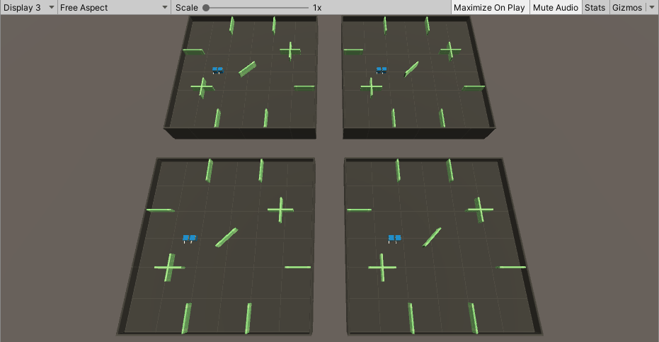
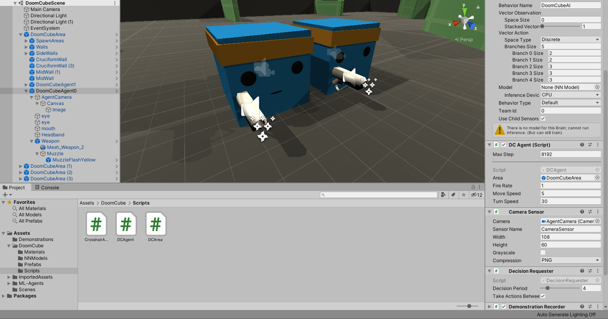
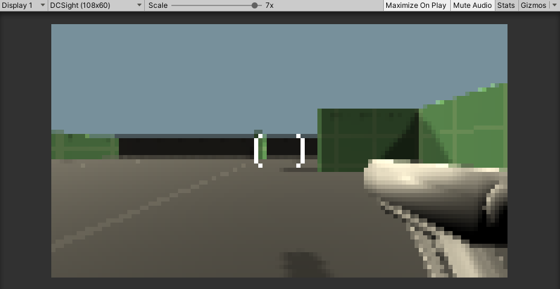
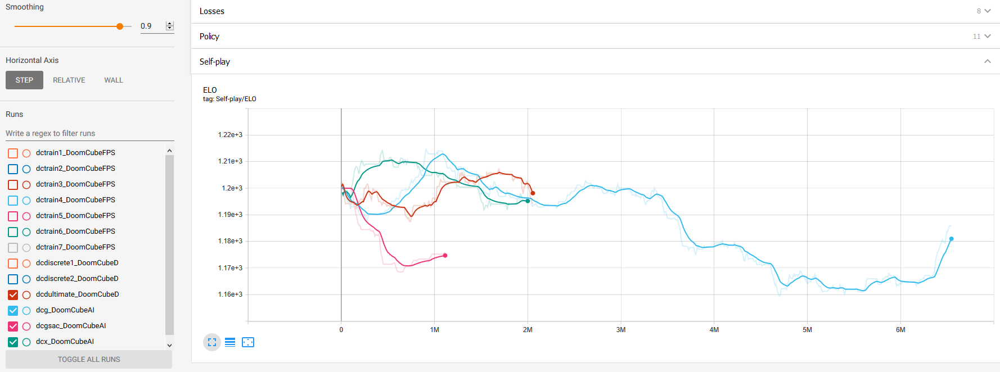

For a project in my master's AI course, I've decided to try training an agent via self-play in a simple FPS setting. I took the Pyramids area, an example from Unity's [ML-Agents](https://github.com/Unity-Technologies/ml-agents/), and modified it as such:

The area is inhabited by two agents, who share the same behaviour:
- they can move forward/still/backward,
- right/still/left,
- rotate right/still/left,
- pull/don't pull the trigger (shooting is further restricted by the fire rate), and
- apply/don't apply a precision factor that reduces the move and rotation speeds.

They use a camera sensor with 108x60 resolution and collect no other observations. The camera also displays a crosshair that changes its colour to red if the agent points towards the other. This is what they (should) see:

While I've tried a number of model/training configurations throughout the project, none of them produced optimistic results after days of training (although my processing unit, a slightly outdated consumer-grade CPU, was rather humble), as indicated by the unstable ELO trajectories below:

In the end, a non-adversarial version of the problem proved to be trainable, while self-play experiments were put on hold. More details can be read from the accompanying [project report](ai-proj-report.pdf).
